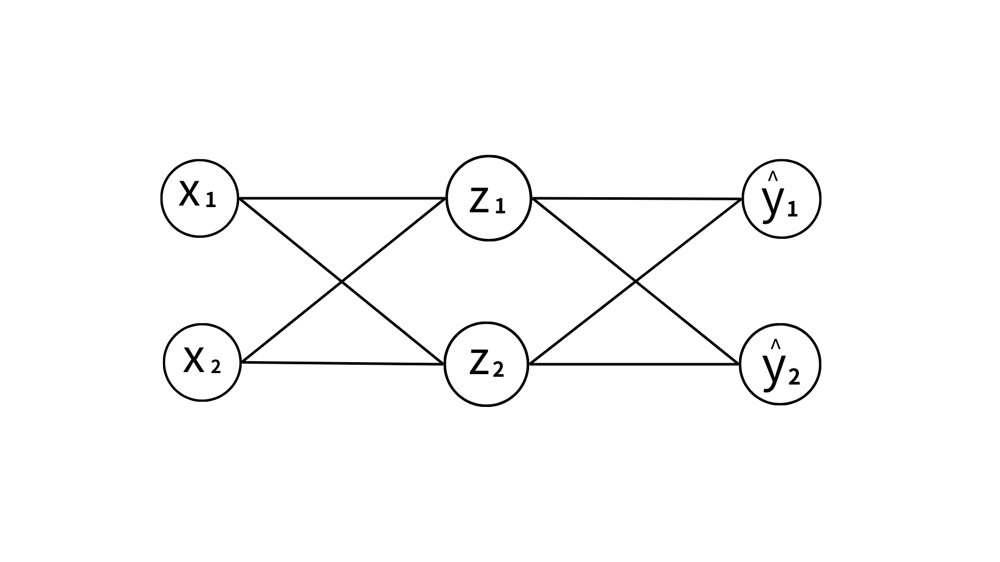

生物系統中，神經元是資訊處理的基本單位。神經元接收訊息，並將傳遞給下一個神經元。

  

---

---
神經元之間的線性關係可以用**權重 w** 和**偏置 b** 來描述。權重決定了訊息的重要性，而偏置則是調整輸出的一個常數項。

舉例來說： $h_1 = \Sigma^n_{j=1} w^1_{1j}x_j+b^1_1, \quad\quad \hat{y}_1 = \Sigma^n_{j=1} w^2_{1j}h_j+b^2_1$

---
再進一步的透過**激活函數**，決定每個神經元輸出的值。常見的激活函數有 Sigmoid function $\phi(x) = \frac{1}{1+e^{-x}}$。

---
所以神經網路**模型**是一個一直重複線性連接和激活的結構，每層的輸出都會成為下一層的輸入，直到給出最終的預測結果。

目標： 最小化**預測值** $\hat{y}$ 與**真實值** $y$ 之間的差異，這個差異透過損失函數 L 來衡量，常見的有均方誤差 $\frac{1}{n}\sum_{k=1}^{n}(y_k - \hat{y}_k )^2$。

---
方法：利用**梯度下降法**來調整權重和偏置，最小化損失 L 。

---
## Example

- $h_i = w^1_{i1}x_1 + w^1_{i2}x_2$
- $\phi$ 是 Sigmoid function，且 $z_i = \phi(h_i)$
- $\hat{y}_i = w^2_{i1}z_1 + w^2_{i2}z_2$
- 總損失 $L = \frac{1}{2} \Sigma^2_{i=1} (y_i - \hat{y}_i)^2 \Rightarrow L(w^1_{11}, w^1_{12}, w^1_{21}, w^1_{22}, \, ... \,  b^1_1, b^1_2, b^2_1, b^2_2)$

---
由於整個模型的架構是個合成函數，所以更新參數時需要利用 **chain rule** 計算梯度。舉例來說，

$\frac{\partial L}{\partial w^1_{11}}
  = \frac{1}{2}\sum^2_{i=1}\, 
     \frac{\partial L}{\partial \hat{y}_i}\, \frac{\partial \hat{y}_i}{\partial z_1}\, \frac{\partial z_1}{\partial w^1_{11}}
  = \frac{1}{2}\sum^2_{i=1}\, 
     \frac{\partial L}{\partial \hat{y}_i}\, \frac{\partial \hat{y}_i}{\partial z_1}\, \phi'(h_1) x_1$

更新參數方式： $w^1_{11} \leftarrow w^1_{11} - \eta \frac{\partial L}{\partial w^1_{11}}$， $\eta$ 是學習率。

---
令全部參數 $\theta = (w^1_{11}, w^1_{12}, w^1_{21}, w^1_{22}, \, ... \,  b^1_1, b^1_2, b^2_1, b^2_2)$ ，則更新方式為： 

$$
\boxed{\theta^{new} =\theta^{old} - \eta \nabla_{\theta} L}
$$

如果將這個等式移項，並使 $\eta$ 趨近於 0，則可得：

$$
\boxed{\dot{\theta} = - \nabla_{\theta} L}
$$

也就是說，梯度下降法就是**梯度流**的離散版本。

---
## 梯度下降法的各種變形

### 標準梯度下降法

最基本的方法。它在每次迭代中使用整個訓練集來計算梯度。這種方法的優點是收斂穩定，但缺點是計算量大，尤其在處理大型數據集時。

### 隨機梯度下降法 

每次迭代中僅使用一個樣本來計算梯度。因為每次更新都會受到單個樣本的影響，可能導致收斂不穩定，但能有效處理大規模資料。

### 小批量梯度下降法

是標準梯度下降和隨機梯度下降的折衷方法。先**將訓練集分成多個小批量**，每次迭代使用一個小批量來計算梯度。這樣可以平衡計算效率和收斂穩定性。

---
### 動量法

借用物理學中的動量概念，動量法在更新參數時考慮了**過去梯度**的累積，引入速度向量 $v_t$ 。公式如下：
$$
v_t = \beta v_{t-1} + (1 - \beta) \nabla_\theta L(\theta_t)
$$
$$
\theta_t = \theta_{t-1} - \eta v_t
$$
其中，$\beta$ 是動量衰減率。

---
當學習率太大時，可能會導致震盪或發散；當學習率太小時，收斂速度又會變慢。
### RMSprop

深度學習之父 **Hinton** 提出，是一種**自適應學習率**方法。核心想法是根據梯度的歷史均方根**動態調整**學習率。更新方法：

$$
g_t = \nabla_{\theta} L(\theta_{t-1})
$$

$$
E[g^2]_t = \beta E[g^2]_{t-1} + (1 - \beta) g_t^2
$$

$$
\theta_t = \theta_{t-1} - \frac{\eta}{\sqrt{E[g^2]_t + \epsilon}} g_t
$$

- $g_t$：時刻 $t$ 的梯度
- $E[g^2]_t$：梯度平方的指數加權移動平均
- $\beta$：衰減率，常設為 0.9； $\eta$：學習率
- $\epsilon$：防止除以零的小常數（如 $10^{-8}$）

---
### Adam

Adam是目前最流行的優化方式之一，結合了動量法與 RMSprop 的優點，能自適應調整學習率。
更新方法：
$$
m_t = \beta_1 m_{t-1} + (1 - \beta_1) g_t
$$
$$
v_t = \beta_2 v_{t-1} + (1 - \beta_2) g_t^2
$$
$$
\hat{m}_t = \frac{m_t}{1 - \beta_1^t}
$$
$$
\hat{v}_t = \frac{v_t}{1 - \beta_2^t}
$$
$$
\theta_t = \theta_{t-1} - \frac{\eta \hat{m}_t}{\sqrt{\hat{v}_t} + \epsilon}
$$
<!--其中，$m_t$ 和 $v_t$ 分別是梯度的一階和二階矩的指數加權平均，$\beta_1$ 和 $\beta_2$ 是衰減率（通常設為 0.9 和 0.999），$\epsilon$ 是防止除以零的小常數。
Adam的優點在於：
1. **自適應學習率**：每個參數都有自己的學習率，能更好地適應不同參數的更新需求。
2. **動量法**：考慮了過去梯度的影響，能更快地收斂。
3. **穩定性**：能在不同的損失函數形狀下保持穩定的收斂速度。-->

---
## PINN

**物理訊息神經網路**（Physics-Informed Neural Network）是一種**結合**物理知識與神經網路的模型，旨在解決PDE等物理問題。將物理定律嵌入到神經網路的損失函數中，使得學習過程中同時滿足數據驅動和物理約束。也就是說，損失函數包含以下部分：

1. **數據損失**：衡量網路預測值與觀測數據之間的差異。
2. **物理損失**：衡量網路輸出是否滿足PDE。
3. **邊界/初始條件損失**：確保網路在邊界/初始條件下的輸出符合物理要求。

---
假設我們要解一熱方程：
$$
\frac{\partial u}{\partial t} = \alpha \frac{\partial^2 u}{\partial x^2}\quad x \in [0, 1], \, t \in [0, T]
$$
$u(x, t)$ 是溫度分佈，$\alpha$ 是熱擴散係數。
邊界條件為 $u(0, t) = 0$ 和 $u(1, t) = 0$，初始條件為 $u(x, 0) = \sin(x)$。

如果是一般 NN，則損失函數只有數據損失：
$$
L_{NN}(\theta) = \frac{1}{N} \sum_{i=1}^{N} (u_i - \hat{u}(x_i,t_i;\theta))^2
$$

---
PINN 則為：
$$
\begin{align*}
L_{PINN}(\theta) = \frac{1}{N} \sum_{i=1}^{N} (u_i - \hat{u}(x_i,t_i;\theta))^2 + \textcolor{red}{\lambda_1 \cdot L_{PDE}} + \textcolor{red}{\lambda_2 \cdot L_{BC}} + \textcolor{red}{\lambda_3 \cdot L_{IC}}
\end{align*}
$$
其中，
$$L_{PDE} = \frac{1}{M} \sum_{m=1}^{M} \left( \frac{\partial \hat{u}}{\partial t}(x_m,t_m,\theta) - \alpha \frac{\partial^2 \hat{u}}{\partial x^2}(x_m,t_m,\theta)  \right)^2
$$
$$L_{BC} = \frac{1}{K} \sum_{k=1}^{K} (\hat{u}(0, t_k) - 0)^2 + (\hat{u}(1, t_k) - 0)^2
$$
$$
L_{IC} = \frac{1}{J} \sum_{j=1}^{J} (\hat{u}(x_j, 0) - \sin(x_j))^2
$$
$J, \, K, \, M$ 分別是初始條件、邊界條件和PDE損失的樣本數。

---
## 自動微分(AD)
在 PINN 中，為了計算 PDE 段落中的導數（如 $\frac{\partial \hat{u}}{\partial t}$、$\frac{\partial^2 \hat{u}}{\partial x^2}$），通常會用到自動微分技術。

這是一種能夠高效且精確計算複雜函數導數的方法。不同於「數值微分」；AD 會讓電腦自動追蹤所有計算步驟，並依據 chain rule 逐步展開導數，所以能同時兼顧精度與效率。

---
## Example
以 $f(x) = x \cdot \sin(x)$ 在 $x=2$ 為例：

拆解計算步驟（建立計算圖）

$u = x, \quad v = \sin(u), \quad f = u \cdot v$

記錄每個變數的值與對 $x$ 的導數

$u = 2, \quad u' = 1$

$v = \sin(2), \quad v' = \cos(2) \cdot u' = \cos(2)$

$f = 2 \cdot \sin(2), \quad f' = v \cdot u' + u \cdot v' = \sin(2) \cdot 1 + 2 \cdot \cos(2)$

數值結果

$f(2) \approx 1.8186, \quad f'(2) \approx 0.9093 + 2 \times (-0.4161) \approx 0.0771$

---
### PINN的優點
1. **物理約束**：PINN能夠將物理定律直接嵌入到模型中，確保預測結果符合物理約束。
2. **數據效率**：PINN能夠在數據稀缺的情況下仍然提供可靠的預測，因為它利用了物理知識。
3. **可解釋性**：由於PINN明確地將物理定律納入模型，因此其預測結果更具可解釋性，便於理解模型的決策過程。